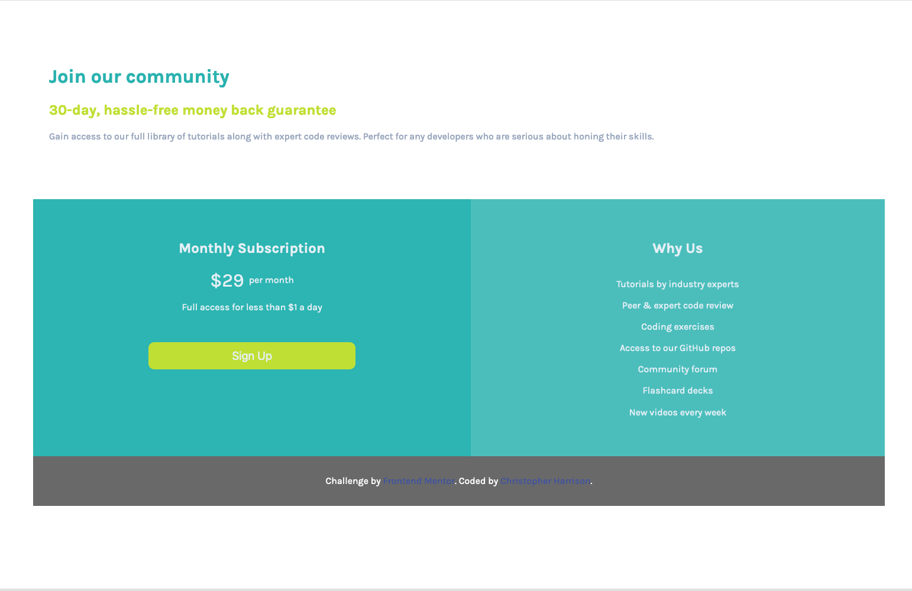

# Frontend Mentor - Single price grid component solution

This is a solution to the [Single price grid component challenge on Frontend Mentor](https://www.frontendmentor.io/challenges/single-price-grid-component-5ce41129d0ff452fec5abbbc). Frontend Mentor challenges help you improve your coding skills by building realistic projects. 

## Table of contents

- [Frontend Mentor - Single price grid component solution](#frontend-mentor---single-price-grid-component-solution)
  - [Table of contents](#table-of-contents)
  - [Overview](#overview)
    - [The challenge](#the-challenge)
    - [Screenshot](#screenshot)
    - [Links](#links)
  - [My process](#my-process)
    - [Built with](#built-with)
    - [Useful resources](#useful-resources)
  - [Author](#author)
  - [Acknowledgments](#acknowledgments)

## Overview
This is my first frontend master's challenge that I have attempted. I had a great time working on this project. It has helped solidify my flexbox and mobile first design skills. 

### The challenge

Users should be able to:

- View the optimal layout for the component depending on their device's screen size
- See a hover state on desktop for the Sign Up call-to-action

### Screenshot

### Links

- Solution URL: [Add solution URL here](https://www.frontendmentor.io/challenges/single-price-grid-component-5ce41129d0ff452fec5abbbc/hub/single-price-grid-challenge-solved-via-flexbox-_ktDde7-u)
- Live Site URL: [Live Site Demo](https://ckharrison.github.io/Single-Price-Grid-Component/)

## My process
My first step in designing this page was to layout the HTML content in accordance to the desktop specifications, I find that it's easier to reason about the content that way. Then I layout the typography and general body styling of the page. I then moved on to designing the mobile layout first, and then finally add in media queries to make the layout match the wider screen specifications.

### Built with

- Semantic HTML5 markup
- CSS custom properties
- Flexbox

### Useful resources

- [CSS Tips and Tricks - A Complete Guide to Flexbox](https://css-tricks.com/snippets/css/a-guide-to-flexbox/) - This was useful to lookup properties that I couldn't remember like flex grow.

## Author

- Website - [CKHarrison.github.io](https://github.com/CKHarrison)
- Frontend Mentor - [@CKHarrison](https://www.frontendmentor.io/profile/CKHarrison)

## Acknowledgments

I just want to thank Frontend Mentors for putting this challenge together. I have been looking for ways to practice CSS in a realistic setting and this website is extremely helpful.
